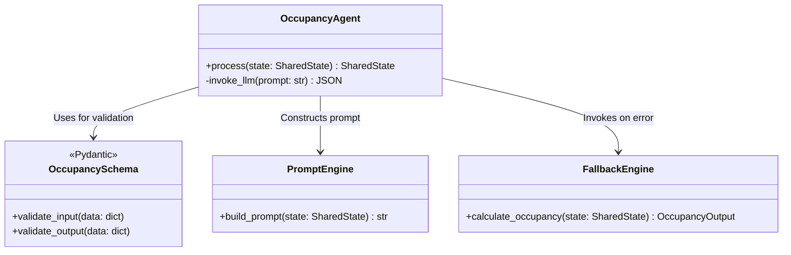
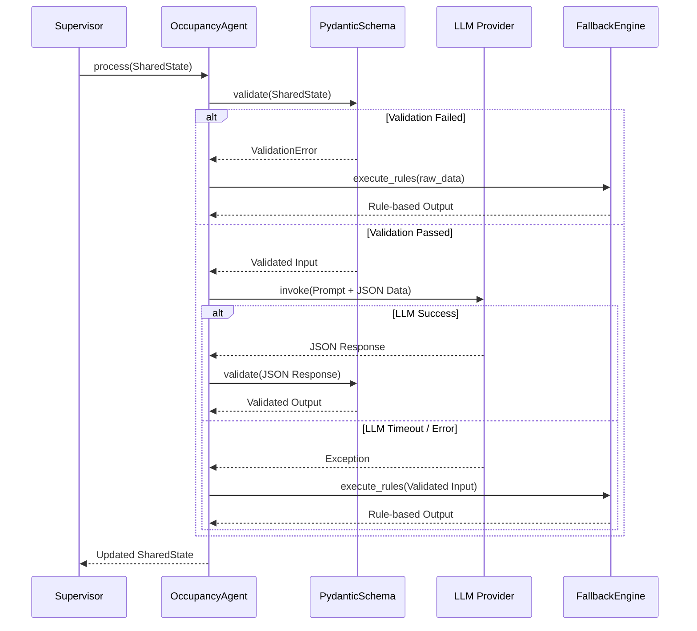

# Voltix - Phase 2: System Design - Occupancy Agent Architecture

## 1. High-Level Architecture
The Occupancy Agent is designed as a standalone, stateless micro-agent using Python and LangGraph. It is invoked with a `SharedState` object containing telemetry and zone context. It returns an updated `SharedState` enriched with occupancy intelligence. The architecture strictly separates data validation, business logic, LLM reasoning, and fallback mechanisms.

## 2. Data Flow
1. **Ingestion:** The agent receives the `SharedState` payload.
2. **Pre-Processing (Validation):** Pydantic strictly validates the incoming telemetry and context.
3. **Prompt Construction:** If validated, the data is transformed into a highly structured prompt using few-shot examples.
4. **LLM Inference:** The prompt is sent to the LLM (e.g., GPT-4o / Claude 3.5 Sonnet) configured for strict JSON output.
5. **Post-Processing (Validation):** The LLM's JSON response is parsed and validated against the output Pydantic schema.
6. **Fallback (If needed):** If the LLM fails, times out, or returns invalid schema, the Fallback Engine executes deterministic rules.
7. **Egress:** The final occupancy state is merged back into the `SharedState` and returned.

## 3. LLM Interaction
- **Model:** Primary reliance on models capable of native JSON mode and high instruction following.
- **Prompting Strategy:** System prompt defines the persona and rules. The User prompt injects the JSON state.
- **Structured Outputs:** The LLM does not generate free text; it fills out a predefined JSON schema representing the occupancy classification, prediction, and reasoning trace.

## 4. Shared State
The Shared State acts as the single source of truth passed between all agents in the Voltix platform. The Occupancy Agent only reads telemetry/calendar data from it and only writes to the `occupancy_metrics` section of it.

## 5. Validation Pipeline
We employ "Parse, Don't Validate" principles using Pydantic v2.
- **Input Guardrails:** Types are strictly enforced (e.g., CO2 must be > 0). Enums restrict sensor types.
- **Output Guardrails:** The LLM output is parsed directly into a Pydantic model. Validation errors automatically trigger a retry (up to 2 times) or route to the Fallback Engine.

## 6. Fallback Architecture
The Fallback Engine is a synchronous, rule-based python class.
- *Condition 1:* If PIR is active -> State is at least `Low`.
- *Condition 2:* If CO2 > 800ppm -> State is `Medium`.
- *Condition 3:* If ACS swipes > Capacity -> State is `Overcrowded`.
The fallback guarantees a response within milliseconds, sacrificing reasoning depth for extreme reliability.

## 7. Error Handling
- **Timeout Exception:** LLM calls are wrapped in an async `asyncio.wait_for`.
- **Validation Exception:** Caught by `ValidationError`, logged, and routed to fallback.
- **API Exception:** Network errors to the LLM provider are caught and routed to fallback.
All errors generate a critical log trace with the input payload for later debugging.

## 8. Folder Structure
The implementation (Phases 3-9) will follow this structure:
```text
c:\Voltix\ai\agents\occupancy\
├── __init__.py
├── occupancy_schema.py      # Phase 3: Pydantic models
├── occupancy_prompt.py      # Phase 4: Prompts
├── occupancy_agent.py       # Phase 5: Core pipeline
├── intelligence.py          # Phase 6: Core logic & helpers
├── fallback.py              # Phase 7: Rule-based engine
└── tests/                   # Phase 8: Testing suite
```

## 9. Class Diagram



## 10. Sequence Diagram


